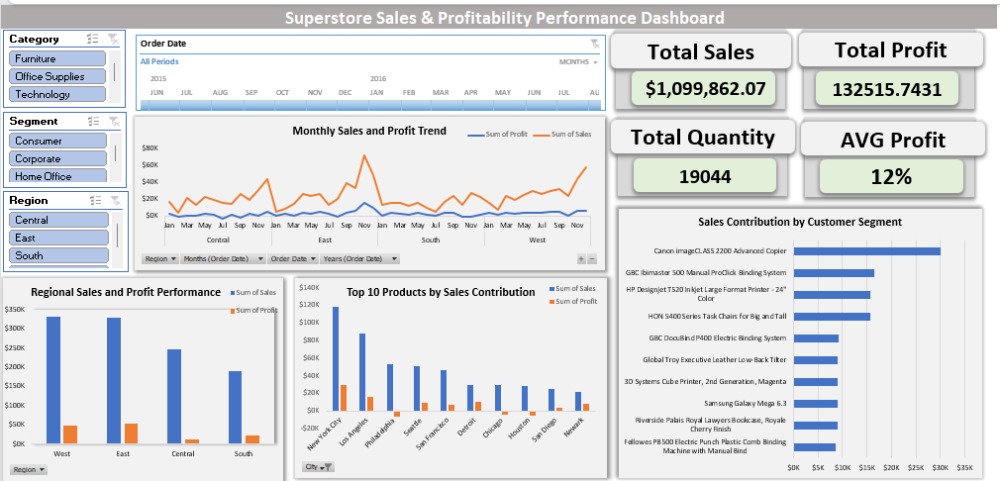
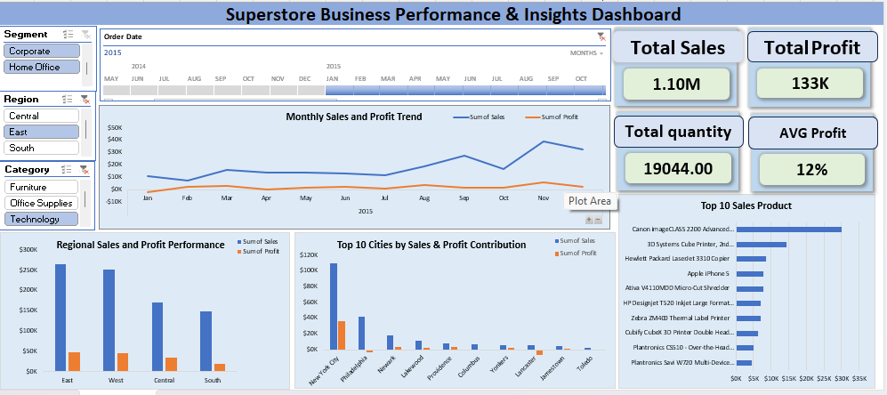

# Superstore Business Performance Analysis

## 📌 Business Problem
Retail businesses generate large volumes of sales data but often lack clear visibility into **profitability, regional performance, product contribution, and customer segments**.  
Without structured analysis, decision-makers struggle to identify **which products, regions, or segments drive revenue and profit**, making it difficult to improve overall business performance.

---

## 🔍 Analysis Approach
To address this problem, the Superstore dataset was analyzed using **Excel and Power Query**, and an interactive dashboard was developed.

The analysis focused on:

- **Sales & Profit Trend Analysis** to evaluate monthly business performance  
- **Regional Performance Analysis** to identify high and low performing regions  
- **Category & Product Analysis** to determine top revenue-generating products  
- **Customer Segment Analysis** to understand contribution from different customer groups  
- **Profitability Monitoring** using key KPIs such as Sales, Profit, Quantity, and Profit Margin  

Interactive filters were implemented to allow users to explore data dynamically by **Category, Region, Segment, and Date**.

---

## 📊 Key Business Insights

- **Sales vs Profit Gap:** Total sales exceed **$1.1M**, but profit margin is only **~12%**, indicating profitability challenges.  
- **Regional Imbalance:** The **East and West regions dominate revenue**, while the **Central region underperforms**.  
- **Category Profitability:** **Technology generates the highest profit**, while **Furniture shows weaker margins**.  
- **Revenue Concentration:** A small group of products contributes a significant share of total revenue.  
- **Seasonal Trends:** Monthly sales fluctuate, indicating **seasonal purchasing patterns**.

---

## 💡 Business Recommendations

Based on the insights, the following strategic actions were identified:

- Improve **profit monitoring** to ensure revenue growth translates into higher margins.  
- Develop **targeted strategies to improve Central region performance**.  
- Optimize **pricing or cost structures for low-margin categories such as Furniture**.  
- Reduce dependency on **top-selling products by strengthening mid-tier product offerings**.  
- Implement **segment-specific marketing strategies** to expand revenue opportunities.

---

## ⚙️ Project Implementation

### Tools & Technologies Used
- **Microsoft Excel** – Data analysis and dashboard development  
- **Power Query** – Data cleaning and transformation  
- **Pivot Tables & Pivot Charts** – Data aggregation and visualization  
- **Interactive Slicers** – Dynamic filtering for dashboard interaction  

### Dataset Information
- **Superstore Sales Dataset**
- Approximately **10,000+ transaction records**
- Includes fields such as **sales, profit, product category, region, customer segment, and order date**

---

## 📷 Dashboard Preview

  
  

---

## 📈 Dashboard Capabilities

The dashboard allows business users to:

- Monitor **Total Sales, Profit, Quantity, and Profit Margin**
- Analyze **monthly sales and profit trends**
- Compare **regional sales performance**
- Identify **top-performing products**
- Evaluate **customer segment contribution**
- Explore insights using **interactive filters**

---

## 🎯 Outcome

This project demonstrates how **raw transactional data can be transformed into actionable business insights** through effective data analysis and visualization.  
The dashboard helps stakeholders make **data-driven decisions related to pricing, product strategy, regional optimization, and profitability improvement**.
